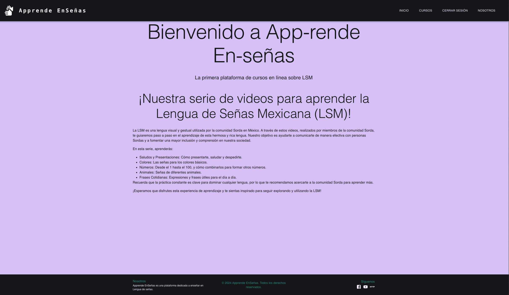
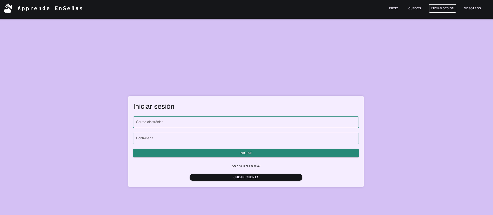
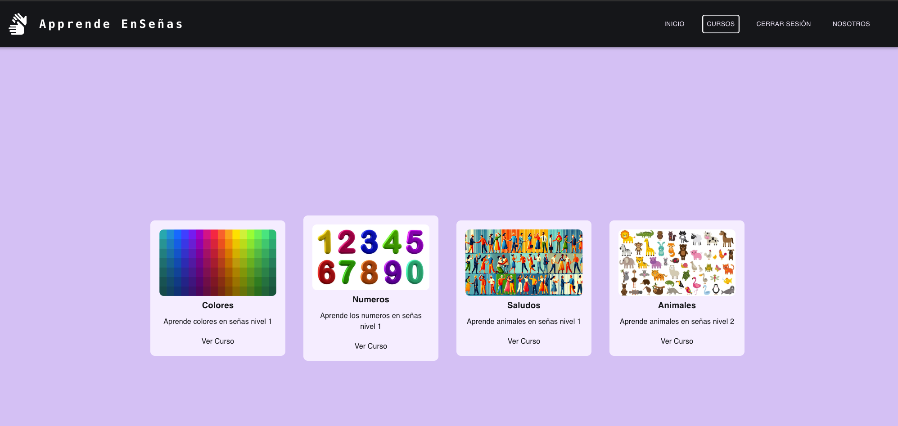
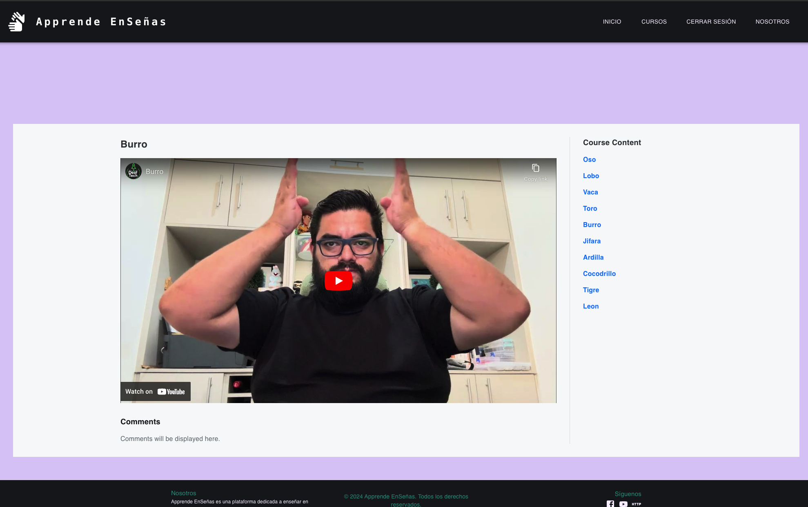

# Apprende EnSeñas

## Table of Contents
* [User Story](#user-story)
* [Description](#description)
* [Installation](#installation)
* [Technologies Used](#technologies-used)
* [How to Use This Application](#how-to-use-this-application)
* [Contributors](#contributors)
* [Testing](#testing)
* [Deployed Application URL](#deployed-application-url)
* [Questions](#questions)

## User Story
As a user interested in learning sign language, I want to be able to create an account, log in, and enroll in courses so that I can access educational videos and improve my sign language skills.

## Description
This project is a web application designed to host educational videos for learning sign language. Users can create accounts, log in, and enroll in various sign language courses provided on the platform.

## Installation
Just click the following link to access the live application: [Apprende EnSeñas](https://apprende-en-se-as.onrender.com)

## Technologies Used
- React
- Styled-components
- GraphQL
- Node.js
- Express.js
- MongoDB
- Materials UI
- Apollo Server
- Authentication (JWT)
- Figma UI
- GitHub
- Render (Deployment)

## How to Use This Application
  Once the application is runnin on a web browser 
  

  Users can create accounts,

  

   Log in

)

  Browse available courses and enroll in courses

   To start learning sign language.
   
   

  
  ## Contributors
  * Fernando Lage - https://github.com/lage356
  * Alfonso Balderas Torres - https://github.com/ponchobt 
  * Bryan Gomez - https://github.com/BryanGC96 
  * Emilio Frias https://github.com/EmilioColds  
  * Carlos Rodriguez  https://github.com/carlos-roma
  
  ## Testing
  N/A
  
  ## Deployed Application URL
  https://apprende-en-se-as.onrender.com/

